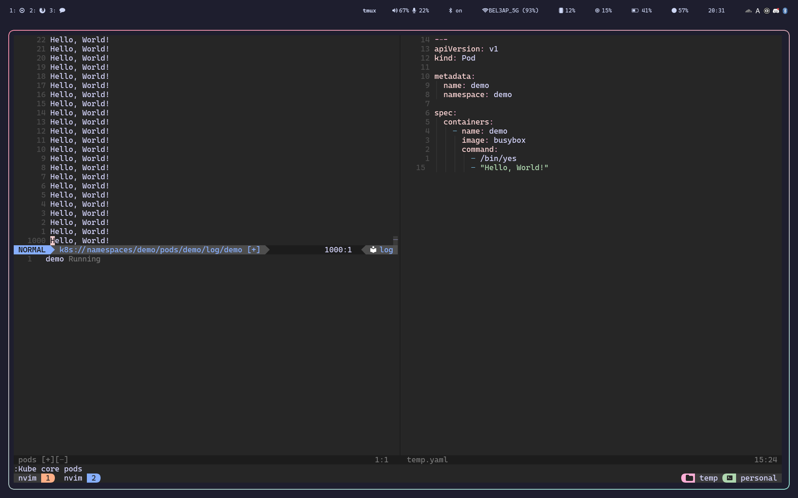

# k8s-lua.nvim

[](https://github.com/BeLeap/k8s-lua.nvim/actions/workflows/test.yaml)
[](https://github.com/BeLeap/k8s-lua.nvim/actions/workflows/format.yaml)

## This Neovim plugin is a work in progress

This Neovim plugin is still under development, and many things could change.
Please do not rely on it for production use,
and report any bugs or issues you find to the [issue tracker](https://github.com/BeLeap/k8s-lua.nvim/issues).

Thank you for your understanding!

## Installation

### [lazy.nvim](https://github.com/folke/lazy.nvim)

```lua
{
  "BeLeap/k8s-lua.nvim",
  dependencies = {
   "nvim-treesitter/nvim-treesitter",
   "rcarriga/nvim-notify", -- Optional
  },
  cmd = { "Kube" },
  config = true,
}
```

## Screenshot



## Available Commands

### `Kube`

```vim
Kube <api_group> <kind>
```

For example, following commands works.

- `Kube core pods`
- `Kube networking.istio.io/v1beta1 virtualservices`

Additionally, I treated context as a core `api_group`.
If there is any better idea, please let me know.

Therefore, following command works.

- `Kube core contexts`

All commands address above shows list view.
List view has following keymaps.

| mode | key | action                                         | note                           |
|:-----|:----|:-----------------------------------------------|:-------------------------------|
| n    | e   | Edit resource under cursor if available        |                                |
| n    | d   | Request deletion under cursor if available     |                                |
| v    | d   | Request deletion under selection if available  |                                |
| n    | s   | Select under cursor                            | Works for contexts, namespaces |
| n    | r   | Reload list view                               |                                |
| n    | l   | Show logs                                      | Works for pods                 |

### `KubeApply`

It runs `kubectl apply -f <buffer>` instead of you.

## Contributing

All contributions are welcome.
Please open a pull request.

See [CONTRIBUTING.md](CONTRIBUTING.md)
